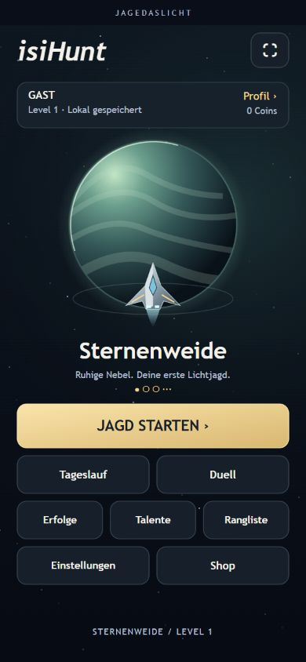
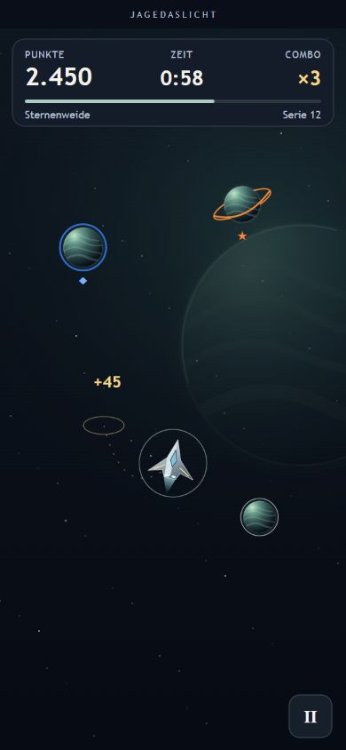

# Grafik-Update: Bestandsaufnahme und erster Entwurf

Datum: 14. September 2026 · Ausgangsversion: **0.1.314**

Status: **Entwurf zur gemeinsamen Durchsicht; noch nicht ins Spiel integriert.**

Übergeordneter Ablauf: [Grafik-Update-Plan](../../GRAFIK_UPDATE_PLAN.md).

## Entwürfe ansehen

| Ansicht   | Normales Handy, 390 × 844                                         | Kleines Handy, 320 × 568                                          |
| --------- | ----------------------------------------------------------------- | ----------------------------------------------------------------- |
| Hauptmenü | [PNG](concept-menu-390x844.png) · [SVG](concept-menu-390x844.svg) | [PNG](concept-menu-320x568.png) · [SVG](concept-menu-320x568.svg) |
| Spiel     | [PNG](concept-game-390x844.png) · [SVG](concept-game-390x844.svg) | [PNG](concept-game-320x568.png) · [SVG](concept-game-320x568.svg) |





Die SVGs sind statische, selbstständige Gestaltungsvorlagen. Sie verändern weder
Spielzustände noch produktive Assets. Das vereinfachte Schriftlogo, Schiff und
Planeten sind illustrative Platzhalter; ein Austausch des bestehenden Logos ist
nicht beschlossen. Zahlen, Auswahlpunkte und aktive Buttonzustände zeigen
Beispielzustände. Die tatsächlichen Freischaltungen und Online-Zustände müssen
bei der Umsetzung aus dem Spiel übernommen werden. Der Kreis um das Schiff im
Spielentwurf illustriert den Sammelbereich; im Spiel muss sein Radius weiterhin
aus der tatsächlichen Reichweite abgeleitet werden.

## Gestalterischer Vorschlag

- Große Weltdarstellung mit Lichtkante, Schattenseite und zurückhaltender Atmosphäre.
- Das eigene Schiff sichtbar vor dem Planeten, mit klarer Silhouette und kurzem Schweif.
- Nur die Hauptaktion erhält eine gefüllte goldene Fläche. Nebenaktionen sind ruhiger.
- Profil auf Name, Level, Speicherstatus und Coins reduzieren; ausführliche Werte
  und Kosmetikdetails bleiben über das Profil erreichbar.
- Alle vorhandenen Einstiege erhalten: Jagd, Tageslauf, Duell, Erfolge, Talente,
  Rangliste, Einstellungen, Shop und Profil. Die Weltinformation im Startweg bleibt erhalten.
- Im Spiel Punkte, Restzeit und Combo auf einer dunklen gemeinsamen Unterlage gruppieren.
- Das kleine Menü bekommt eine eigene kompakte Anordnung statt einer bloßen Verkleinerung.
- Weltenauswahl bleibt beim vorhandenen vertikalen Wischen. Die Punkte im Entwurf
  sind nur eine Richtungsstudie; zugängliche Vor-/Zurück-Bedienung, Sperrstatus und
  Weltinformation sind in der konkreten Menüumsetzung noch auszuarbeiten.

### Vorgeschlagene Gestaltungswerte

Diese Werte sind Vorschläge für Schritt 2, noch keine geänderten Runtime-Konstanten.

| Element                    | Entwurf / Ziel                                                      |
| -------------------------- | ------------------------------------------------------------------- |
| Grundfläche                | Dunkles Blau/Grün, etwa `#0b1721` bis `#060b14`                     |
| Panel                      | Etwa `#13212c`, ruhige Kontur `#2b424b`                             |
| Text / sekundärer Text     | Bestehende Werte `#f4f1e8` / `#b8c0d9`                              |
| Hauptaktion                | Bestehendes Gold als Ausgangspunkt; Verlauf `#ffe3a4` bis `#dfb564` |
| Schrift                    | Bestehende Systemschrift; kein zusätzlicher Font-Download           |
| Primärer Button            | 48 CSS-Pixel hoch im kompakten, 56 im normalen Entwurf              |
| Sekundäre Buttons          | Mindestens 44 CSS-Pixel hoch; zwischen Reihen 10 Pixel              |
| Wesentliche Beschriftungen | Im Entwurf 12–19 CSS-Pixel; Zahlen/Titel größer                     |
| Dekorative Kleinsttexte    | 10–11 Pixel; keine alleinige Trägerschaft wichtiger Information     |

Die Runtime arbeitet mit 720 logischen Pixeln Breite. Entwurfswerte in
**CSS-Pixeln dürfen nicht unverändert als Phaser-Koordinaten übernommen werden**.
Die Layoutberechnung muss Bildschirmmaßstab und verfügbare Höhe berücksichtigen.
Bei Platzmangel zuerst Dekoration verkleinern, wesentliche Text- und Touchgrößen erhalten.

## Bestandsaufnahme: tatsächlich geprüft

Lokaler Vite-Server im Modus `playtest`, leere Backend-Konfiguration, Gast/Level 1,
Sternenweide. Prüfung über den verbundenen Edge-Browser; Größen sind simulierte
CSS-Viewports und keine echten iPhones. Gemeldeter DPR rund 1.

| Viewport  | Interner Phaser-Canvas | Gemessenes Canvas-Rechteck in CSS-Pixeln | Aufnahme                                                                                                 |
| --------- | ---------------------- | ---------------------------------------- | -------------------------------------------------------------------------------------------------------- |
| 320 × 568 | 720 × 1280             | x=9, y=32, Breite=301,5, Höhe=536        | [Menü](baseline-menu-320x568.png), [Countdown/HUD](baseline-countdown-320x568.png)                       |
| 390 × 844 | 720 × 1499             | x=0, y=32, Breite=390, Höhe≈811,96       | [Menü](baseline-menu-390x844.png)                                                                        |
| 430 × 932 | 720 × 1507             | x=0, y=32, Breite≈429,99, Höhe=900       | [Menü](baseline-menu-430x932.png), [Spiel](baseline-game-430x932.png), [Shop](baseline-shop-430x932.png) |

Der Startweg Menü → Weltinformation → Countdown → Spiel wurde über sichtbare
Buttons durchlaufen. Im großen Format wurden ein Sammelobjekt, die Spielfigur
mit Bewegung und die Anzeige während des beginnenden Runs sichtbar. Die kleine
Spielaufnahme zeigt ausdrücklich den Countdown, keine volle Spielrunde.

### Befunde und Konsequenzen

1. **Sehr kleine Beschriftungen:** Bei 320 × 568 beträgt der Canvas-Maßstab
   301,5 / 720 = 0,41875. Die verwendeten 17 logischen Pixel ergeben damit
   rechnerisch **7,12 CSS-Pixel**. Die kleine Schrift ist im Screenshot sichtbar.
   Konsequenz: wichtige Informationen reduzieren und in tatsächlichen
   Bildschirmgrößen planen.
2. **Kleine Touchflächen:** Eine 60 logische Pixel hohe Menüschaltfläche ergibt
   im kleinen Format rechnerisch **25,13 CSS-Pixel**. `ensureTouchTarget()` sichert
   aktuell 44 logische Pixel, keine 44 CSS-Pixel. Für die neue Oberfläche muss
   die Mindestgröße nach Canvas-Skalierung geprüft werden. Die bestehenden
   Trefferflächen wurden in dieser Etappe nicht vollständig vermessen.
3. **Visuelle Gewichtung:** Der Profilblock enthält viele Zeilen; die Welt
   erscheint als kleine Karte. Jagd und Tageslauf stehen gleich stark nebeneinander,
   weitere Buttons leuchten ebenfalls. Konsequenz: kompakteres Profil, große Welt,
   eine klare Hauptaktion.
4. **Bereits vorhandene Tiefe:** `createDriftLayers()` besitzt zwei unterschiedlich
   schnelle Sternenebenen. `createWorldBackdrop()` setzt Planeten und Nebel ein.
   Diese Grundlage weiterentwickeln, keine parallele Hintergrundlösung bauen.
5. **Weltvarianten wiederholen sich:** Zehn Welten treffen auf fünf Hintergrund-
   und Planetenkonfigurationen, die per Modulo gewählt werden. Schritt 3 soll
   die zusätzlichen Welten eigenständig gestalten.
6. **3D funktioniert:** Im Shop wurde Orbital-01 als echte Vorschau sichtbar.
   Sein eigener Canvas lag bei x≈137,36/y≈52,01 mit 155,28 × 83,61 CSS-Pixeln;
   die darunterliegende Beschriftung war im Screenshot nicht verdeckt.
7. **Mögliche Überläufe bei umfangreichen Profilwerten:** Namen und mehrere
   Profilzeilen werden ohne gemeinsame rechte Textgrenze angelegt. Lange Namen,
   große Zahlen und lange Kosmetikbezeichnungen sind noch gezielt zu testen.
   Dies ist ein offener Prüfpunkt, kein bestätigter Überlappungsfehler.

## Technische Grundlage für 3D

Geprüfte Dateien: `src/ui/threeDShipPreview.ts`, `src/entities/Player.ts`,
`src/scenes/ShopScene.ts`, `src/ui/egoAssets.ts`, `src/ui/widgets.ts`.

| Vorhanden                                                 | Bedeutung für den Umbau                                                                      |
| --------------------------------------------------------- | -------------------------------------------------------------------------------------------- |
| Dynamischer Import von Three.js und OBJLoader             | Grundlage für bedarfsgerechtes Laden beibehalten                                             |
| Neun OBJ-Modelle                                          | Für einen ersten Hangar können vorhandene Modelle verwendet werden                           |
| Orthografische Kamera senkrecht über X/Z-Ebene            | Gut für Draufsicht; Hangar braucht einen separat einstellbaren Blickwinkel                   |
| Ambient-, Haupt- und Kantenlicht, Standardmaterial        | Beleuchtungsgrundlage vorhanden; differenzierte Materialien und Cockpitgestaltung noch offen |
| Automatische Rotation um Y                                | Noch keine Drehbedienung; Pointer-Events sind derzeit ausgeschaltet                          |
| DOM-Canvas über Phaser im Shop und optional im Solo-Spiel | DOM- und Phaser-Zeichenreihenfolge ausdrücklich zusammen prüfen                              |
| Pixelverhältnis auf maximal 1,5 begrenzt                  | Bestehende Begrenzung als Ausgangspunkt für Qualitätsstufen nutzen                           |
| Fallback und Freigabe von Geometrie/Material/Renderer     | Gute Grundlage; Modellwechsel und wiederholtes Öffnen weiter testen                          |

Die neun OBJ-Dateien haben zusammen **139.064 Byte**. Die erfassten 127–324
`f`-Zeilen je Modell sind Polygonflächen, nicht automatisch Dreiecke.
Details: [Modellinventar](model-inventory.json).

**Wichtig für Schritt 4/7:** `ThreeDShipPreview.update()` dreht gegenwärtig immer,
auch wenn reduzierte Bewegung gewünscht ist. Die Anrufer im Shop und Player
unterdrücken dieses Update nicht. Für die neue Darstellung eine ruhige Alternative
vorsehen. Kamera und Interaktion des Hangars separat konfigurierbar halten, damit
die bestehende Spielansicht nicht versehentlich ebenfalls umgestellt wird.

### Vorgeschlagene technische Aufteilung

- Menü und Spielfeld: Phaser bleibt für UI, Steuerung und Spielregeln zuständig.
- Planeten: einmal vorbereitete beziehungsweise gemeinsam nutzbare Kugeloptik,
  darüber Atmosphäre und getrennte Ringhälften. Kein eigener WebGL-Renderer je Planet.
- Hintergründe: bestehende Ebenen erweitern, Bewegung an reduzierte Bewegung koppeln.
- Schiffe: visuelle Neigung getrennt von Position und Sammelradius.
- Hangar: vorhandene Three.js-Klasse um einen eigenen Präsentationsmodus erweitern;
  bedarfsgerecht laden, korrekt freigeben und 2D-Fallback erhalten.
- Qualität: reduzierte Partikel/Schichten als sparsame Variante; Anzahl und konkrete
  Grenzwerte nach einer belastbaren Laufzeitmessung bestimmen.

## Pixelprüfung der Entwürfe

Vier Entwürfe im Browser gerendert, Screenshot gesichert und echte SVG-Text-/
Buttonrechtecke mit `getBoundingClientRect()` aufgenommen. Messdaten liegen als
`concept-*.geometry.json` daneben. Die Auswertung prüft Bildschirmgrenzen,
Beschriftungen innerhalb der Buttonfläche, Text/Text- und Button/Button-
Überlappungen sowie mindestens 44 Pixel große Buttonrechtecke. Rundungstoleranz: 0,5 Pixel.

| Entwurf         | Texte | Buttonflächen | Gemeldete Probleme |
| --------------- | ----- | ------------- | ------------------ |
| Menü 320 × 568  | 18    | 9             | 0                  |
| Menü 390 × 844  | 19    | 9             | 0                  |
| Spiel 320 × 568 | 13    | 1             | 0                  |
| Spiel 390 × 844 | 13    | 1             | 0                  |

**Während der visuellen Prüfung korrigiert:** Der Schweif im ersten Menüentwurf
kam dem Welttitel zu nahe. Schweif verkürzt und Schiff nach oben versetzt; die
gesicherten Menübilder und Geometriedaten zeigen die korrigierte Fassung.

Die Auswertung prüft statische Entwurfsrechtecke, noch keine Phaser-Hitboxen,
bewegten Modelle, alle dynamischen Textwerte oder verdeckten Pixel. Diese Prüfungen
folgen in der jeweiligen Umsetzungsetappe. Absichtliche Überdeckungen zwischen
Schiff und Planet werden visuell beurteilt.

Reproduktion:

```powershell
node docs/design/2026-09-14/generate-concepts.mjs
node docs/design/2026-09-14/verify-concepts.mjs
```

Nach Änderungen an den SVGs müssen **zuerst neue Browser-Geometriedaten und
Screenshots aufgenommen werden**. `verify-concepts.mjs` wertet nur die gespeicherten
Messungen aus und behauptet keine neue Browserprüfung.

## Build und noch offene Messungen

`npm run build` bestanden: Typprüfung und Produktionsbuild erfolgreich. Bestehende
Warnung zu großen Chunks bleibt. Gemeldete gzip-Größen dieses Ausgangsstands:

| Chunk                        | gzip      |
| ---------------------------- | --------- |
| App-Einstieg                 | 107,11 kB |
| Phaser                       | 339,84 kB |
| Three.js, dynamisch geladen  | 189,57 kB |
| OBJLoader, dynamisch geladen | 2,98 kB   |
| Supabase                     | 57,11 kB  |

Das sind Build-Größen, **keine gemessenen Ladezeiten**. Unter der Browsersteuerung
lief der Countdown zwischen Eingaben auffällig langsam; dadurch sind aus dieser
Sitzung keine belastbaren Echtzeit-FPS-, Startzeit- oder Heap-Baselines abzuleiten.
Die Ursache wurde nicht abschließend festgestellt. Keine Performance-Freigabe erteilt.

Vor der grafischen Runtime-Umsetzung nachholen:

- Laufzeitmessung mit durchgehend aktivem Spielfenster und vollständiger Runde.
- Speicher vor/nach wiederholten Shop-/Hangarwechseln und mit aktivem 3D-Modell.
- Lange Namen, große Punkt-/Coinwerte, freigeschaltete Welten und größere Sammlungen.
- Echte mobile Hardware, iOS/Safari, Safe Areas, reduzierte Bewegung und Duellstände.

## Nächste gemeinsame Entscheidung

Den Menüentwurf in normaler und kompakter Größe durchsehen: Passt die Richtung
mit großem Planeten, sichtbarem Schiff und ruhigen Nebenaktionen? Anschließend
die noch offenen Baseline-Messungen ergänzen und **Schritt 2 am Hauptmenü** umsetzen.
Spiel-HUD, Welteffekte und Hangar bleiben ihre eigenen späteren Etappen.
