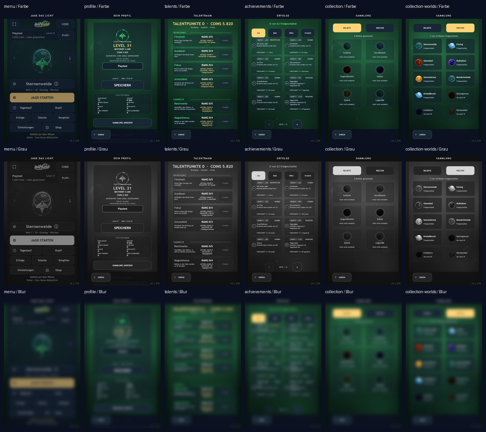

# Sichtprüfung der grafischen Modernisierung

Stand: 24. September 2026, lokaler Build `0.1.378`. Die Kontakttafel nutzt
Chromium-Screenshots bei 390 × 664 CSS-Pixeln und DPR 3 aus
`npm run playtest`. Oben stehen Farbbilder, darunter Graustufen und eine
stark weichgezeichnete Übersicht. Die Tafel ist ein Vergleichswerkzeug,
kein automatischer Kontrasttest.

Bei der Sichtprüfung bleiben Hauptaktion im Menü, Level im Profil und die
aktiven Reiter in Sammlung und Erfolgen auch in der Unschärfe hervorgehoben.
Talent- und Erfolgskarten tragen viele Angaben; sie sind für gezieltes Lesen
gedacht und verlangen auf kleinen Geräten weiterhin eine eigene Sichtprüfung.
Die graue Ansicht zeigt, dass freigeschaltete und gesperrte Albumobjekte
durch Text und Helligkeit getrennt sind.

Die lokale simulierte Leistungsmessung nach Weltzeichen und Icons meldete Start
169 ms, Frame-P95 16,67 ms, ca. 69 MB genutzten JS-Speicher und `passed: true`. Dieser Wert
ist nach dem Umbau aufgenommen und keine Vorher-Nachher-Messung. GPU-Speicher,
echte Mobilgeräte, 2D/3D-Dauertest und Effektstufen-Vergleich fehlen.

Die Screenshots zeigen emulierte Viewports. Hardware-Safe-Areas und
Systemtastatur lassen sich damit nicht freigeben.
